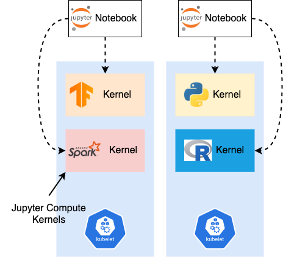
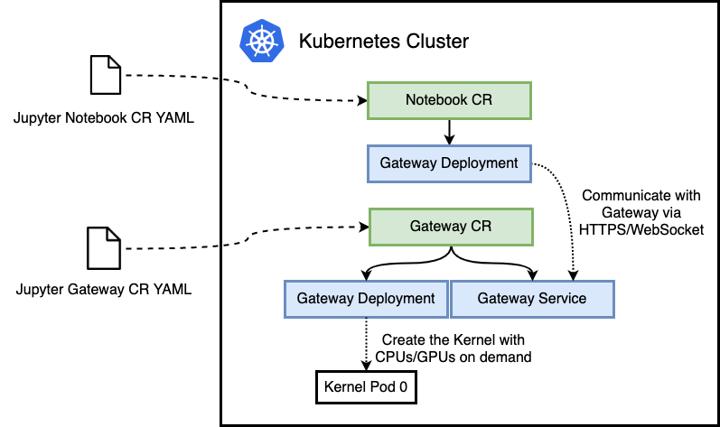
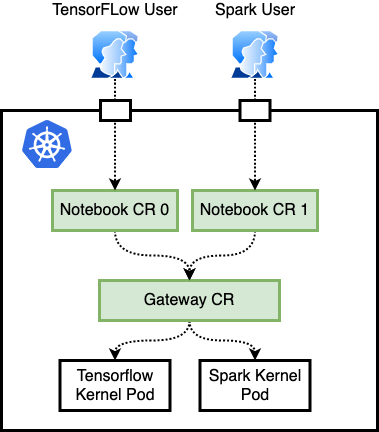
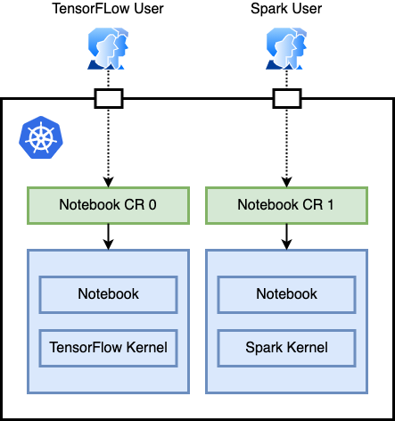

# elastic-jupyter-operator: Elastic Jupyter on Kubernetes

Kubernetes 原生的弹性 Jupyter 即服务

## 介绍

为用户**按需**提供弹性的 Jupyter Notebook 服务。elastic-jupyter-operator 提供以下特性：

- GPU 空闲时自动释放资源到 Kubernetes 集群
- 资源延迟申请，在使用时按需申请对应 CPU/内存/GPU 资源
- 多 Jupyter 共享资源池，提高资源利用率

<p align="center"></p>

## 部署

```bash
kubectl apply -f ./hack/enterprise_gateway/prepare.yaml
make deploy
```

## 架构

elastic-jupyter-operator 的架构如图所示，`JupyterGateway` 和 `JupyterNotebook` 是两个 CRD。其中 Notebook 是 Jupyter Notebook 的前端服务，负责面向用户提供用户界面，并且与后端服务通过 HTTPS 和 Websocket 进行通信，处理用户的计算请求。

Gateway 是对应的后端服务。它负责处理来自 Notebook CR 的请求，通过调用 Kubernetes 的 API 按需创建出真正负责处理用户计算任务的 Kernel。

<p align="center"></p>

### 多用户

多个用户可以创建多个 Notebook CR，连接同一个 Gateway CR，以起到复用资源的作用。Gateway 会根据不同 Jupyter Notebook 的请求按需创建出对应的 Kernel。在某个用户暂时不进行任务时，会将对应 Kernel Pod 回收删除，释放资源。

<p align="center"></p>

## 对比

elastic-jupyter-operator 部分参考了 Kubeflow jupyter-controller 和 Jupyter enterprise gateway 的设计，这里介绍了与两者的不同。

### 与 Kubeflow Jupyter Controller 的比较

Kubeflow Jupyter Controller 也提供了在 Kubernetes 上部署 Jupyter Notebook 的解决方案。相比于 elastic-jupyter-operator，其最大的问题在于它在一个 Pod 中运行了 Notebook 前端与负责计算的 Kernel，导致无法在 Kernel 空闲时回收资源。

<p align="center"></p>

### 与 Jupyter Enterprise Gateway 的比较

Jupyter Enterprise Gateway 提供了弹性 Jupyter 服务的基础，elastic-jupyter-operator 也是基于它来设计和实现的。与 Jupyter Enterprise Gateway 相比，elastic-jupyter-operator 提供了云原生的实现。Jupyter Enterprise Gateway 需要用户自行部署和维护 Gateway 和 Notebook，而 elastic-jupyter-operator 则简化了在 Kubernetes 上运维的复杂度。

## 使用

首先，创建一个 Jupyter Gateway CR：

```bash
kubectl apply -f ./config/samples/kubeflow.tkestack.io_v1alpha1_jupytergateway.yaml
```

```yaml
apiVersion: kubeflow.tkestack.io/v1alpha1
kind: JupyterGateway
metadata:
  name: jupytergateway-sample
spec:
  cullIdleTimeout: 3600
```

其中 `cullIdleTimeout` 是一个配置项，在 Kernel 空闲指定 `cullIdleTimeout` 秒内，会由 Gateway 回收对应 Kernel 以释放资源。

其次需要创建一个 Jupyter Notebook CR 实例，并且指定对应的 Gateway CR：

```bash
kubectl apply -f ./config/samples/kubeflow.tkestack.io_v1alpha1_jupyternotebook.yaml
```

```yaml
apiVersion: kubeflow.tkestack.io/v1alpha1
kind: JupyterNotebook
metadata:
  name: jupyternotebook-sample
spec:
  gateway:
    name: jupytergateway-sample
    namespace: default
```

集群上所有资源如下所示：

```
NAME                                          READY   STATUS    RESTARTS   AGE
pod/jupytergateway-sample-6d5d97949c-p8bj6    1/1     Running   2          11d
pod/jupyternotebook-sample-5bf7d9d9fb-nq9b8   1/1     Running   2          11d

NAME                            TYPE        CLUSTER-IP      EXTERNAL-IP   PORT(S)    AGE
service/jupytergateway-sample   ClusterIP   10.96.138.111   <none>        8888/TCP   11d
service/kubernetes              ClusterIP   10.96.0.1       <none>        443/TCP    31d

NAME                                     READY   UP-TO-DATE   AVAILABLE   AGE
deployment.apps/jupytergateway-sample    1/1     1            1           11d
deployment.apps/jupyternotebook-sample   1/1     1            1           11d

NAME                                                DESIRED   CURRENT   READY   AGE
replicaset.apps/jupytergateway-sample-6d5d97949c    1         1         1       11d
replicaset.apps/jupyternotebook-sample-5bf7d9d9fb   1         1         1       11d
```

随后可以通过 NodePort、`kubectl port-forward`、ingress 等方式将 Notebook CR 对外暴露提供服务，这里以 `kubectl port-forward` 为例：

```
kubectl port-forward jupyternotebook-sample-5bf7d9d9fb-nq9b8 8888
```

## API 文档

请见 [API 文档](docs/api/generated.asciidoc)
