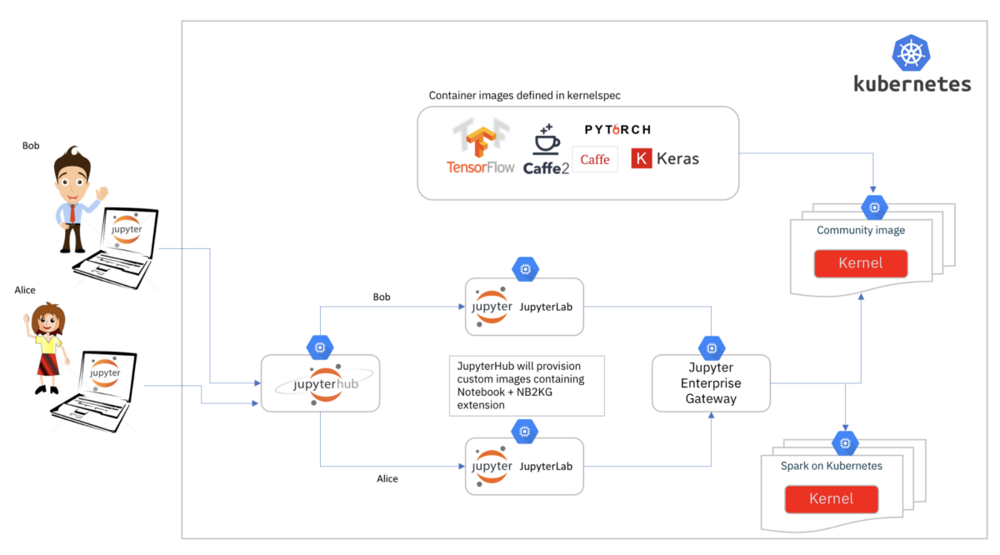
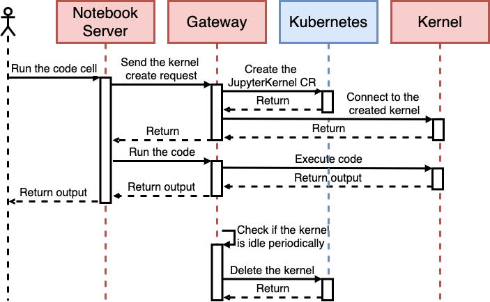

# Elastic Jupyter Notebooks on Kubernetes: the Cloud Native Way


Running [Jupyter Notebook][] on Kubernetes is common, but it's not easy. The notebook server runs kernels on the host by default. However, it is necessary to run remote kernels if [Jupyter Notebook][] is deployed and used on Kubernetes.

Deep learning model training is a good example. It requires lots of resources, usually some GPUs. Meanwhile, GPU resources are expensive to use. Thus users expect sharing GPUs between notebooks.

## State of the art

There are some existing [Jupyter Notebook][] operators in Kubernetes community, such as [Kubeflow jupyter operator](https://github.com/kubeflow/kubeflow/tree/master/components/notebook-controller). These projects just deploy the [Jupyter Notebook][] as a deployment directly on Kubernetes. The GPU utilization does not meet our expectation, because the GPUs are allocated by users statically.

[Jupyter Enterprise Gateway][] could help us improve the utilization by running the notebook server processes and kernel processes separately. But there are some limitations. [Jupyter Enterprise Gateway][] is designed to be used on different resource managers, e.g. Yarn, Kubernetes, etc. Thus it is not Kubernetes native. Maintaining such a gateway and multiple notebook servers/kernels is not easy.

<p align="center"></p>

Besides this, customizing the kernel specifications requires [rebooting the enterprise gateway](https://github.com/jupyter/enterprise_gateway/blob/master/etc/docker/enterprise-gateway/Dockerfile#L30) on Kubernetes, because the kernel specifications are hard-coded in the image.

Last, the resources used by the kernel can not be updated easily. The Kernel YAML template is defined as [jinja2 template](https://github.com/jupyter/enterprise_gateway/blob/master/etc/kernel-launchers/kubernetes/scripts/kernel-pod.yaml.j2). It is also hard-coded in the image.

To solve these problems, we implemented a new operator [elastic-jupyter-operator][] based on Kubernetes and [Jupyter Enterprise Gateway][], to make it easy to deploy and use elastic [Jupyter Notebook][] on Kubernetes. You can manage the notebook server and kernels on Kubernetes in a declarative way via the CustomResourceDefinitions (CRDs), instead of getting trouble with the containers and networking things.

## Quick start

First you need to clone the repository and install the operator. Five CustomResourceDefinitions (CRDs) are installed in the cluster: `JupyterGateway`, `JupyterNotebook`, `JupyterKernel`, `JupyterKernelTemplate` and `JupyterKernelSpec`.

```yaml
git clone git@github.com:tkestack/elastic-jupyter-operator.git
kubectl apply -f ./hack/enterprise_gateway/prepare.yaml
make deploy
```

### Remote kernels

Users can create the elastic [Jupyter Notebook][] on Kubernetes by creating `JupyterNotebook` and `JupyterGateway`.

```bash
$ cat ./examples/elastic/kubeflow.tkestack.io_v1alpha1_jupyternotebook.yaml
apiVersion: kubeflow.tkestack.io/v1alpha1
kind: JupyterNotebook
metadata:
  name: jupyternotebook-elastic
spec:
  gateway:
    name: jupytergateway-elastic
    namespace: default
  auth:
    mode: disable

$ cat ./examples/elastic/kubeflow.tkestack.io_v1alpha1_jupytergateway.yaml
apiVersion: kubeflow.tkestack.io/v1alpha1
kind: JupyterGateway
metadata:
  name: jupytergateway-elastic
spec:
  cullIdleTimeout: 3600
  image: ccr.ccs.tencentyun.com/kubeflow-oteam/enterprise-gateway:2.5.0

$ kubectl apply -f ./examples/elastic/kubeflow.tkestack.io_v1alpha1_jupyternotebook.yaml
$ kubectl apply -f ./examples/elastic/kubeflow.tkestack.io_v1alpha1_jupytergateway.yaml
$ kubectl port-forward deploy/jupyternotebook-elastic 8888:8888
```

When the code is executed in the notebook page, there will be a new kernel pod created in the cluster.

```
NAME                                          READY   STATUS    RESTARTS   AGE
kernel-219cfd49-89ad-428c-8e0d-3e61e15d79a7   1/1     Running   0          170m
jupytergateway-elastic-868d8f465c-8mg44       1/1     Running   0          3h
jupyternotebook-elastic-787d94bb4b-xdwnc      1/1     Running   0          3h10m
```

### Remote kernels with custom configuration

If you want to custom the kernel deployment, for example. you want to update the resource requirements of the python kernel or use different images for the kernel, you can deploy the jupyter notebooks and gateways with custom kernels.

First, you need to create the JupyterKernelSpec CR, which is used to generate the [Jupyter kernelspec](https://jupyter-client.readthedocs.io/en/stable/kernels.html).

```yaml
$ cat examples/elastic-with-custom-kernels/kubeflow.tkestack.io_v1alpha1_jupyterkernelspec.yaml
apiVersion: kubeflow.tkestack.io/v1alpha1
kind: JupyterKernelSpec
metadata:
  name: python-kubernetes
spec:
  language: Python
  displayName: "Python on Kubernetes as a JupyterKernelSpec"
  image: ccr.ccs.tencentyun.com/kubeflow-oteam/jupyter-kernel-py:2.5.0
  className: enterprise_gateway.services.processproxies.kubeflow.KubeflowProcessProxy
  # Use the template defined in JupyterKernelTemplate CR.
  template:
    namespace: default
    name: jupyterkerneltemplate-elastic-with-custom-kernels
  command: 
  # Use the default scripts to launch the kernel.
  - "kubeflow-launcher"
  - "--verbose"
  - "--RemoteProcessProxy.kernel-id"
  - "{kernel_id}"
  - "--RemoteProcessProxy.port-range"
  - "{port_range}"
  - "--RemoteProcessProxy.response-address"
  - "{response_address}"

$ cat examples/elastic-with-custom-kernels/kubeflow.tkestack.io_v1alpha1_jupyterkerneltemplate.yaml
apiVersion: kubeflow.tkestack.io/v1alpha1
kind: JupyterKernelTemplate
metadata:
  name: jupyterkerneltemplate-elastic-with-custom-kernels
spec:
  template:
    metadata: 
      app: enterprise-gateway
      component: kernel
    spec:
      restartPolicy: Always
      containers:
        - name: kernel

$ kubectl apply -f  ./examples/elastic-with-custom-kernels/kubeflow.tkestack.io_v1alpha1_jupyterkernelspec.yaml
$ kubectl apply -f ./examples/elastic-with-custom-kernels/kubeflow.tkestack.io_v1alpha1_jupyterkerneltemplate.yaml
```

There will be a configmap created with the given CR, and it will be mounted into the gateway.

```yaml
$ cat examples/elastic-with-custom-kernels/kubeflow.tkestack.io_v1alpha1_jupytergateway.yaml
apiVersion: kubeflow.tkestack.io/v1alpha1
kind: JupyterGateway
metadata:
  name: jupytergateway-elastic-with-custom-kernels
spec:
  cullIdleTimeout: 10
  cullInterval: 10
  logLevel: DEBUG
  image: ccr.ccs.tencentyun.com/kubeflow-oteam/enterprise-gateway:dev
  # Use the kernel which is defined in JupyterKernelSpec CR.
  kernels: 
  - python-kubernetes

$ kubectl apply -f ./examples/elastic/kubeflow.tkestack.io_v1alpha1_jupyternotebook.yaml
$ kubectl apply -f ./examples/elastic/kubeflow.tkestack.io_v1alpha1_jupytergateway.yaml
$ kubectl port-forward deploy/jupyternotebook-elastic-with-custom-kernels 8888:8888
```

## Design and implementation

[elastic-jupyter-operator][] reuses the [Jupyter Enterprise Gateway][] to support remote execution of Jupyter notebooks. The request will be sent to the notebook server process first when users execute the code in the browser. But the request cannot be processed since there is no kernel to execute it. The notebook server will issue a request then to the gateway to create a new kernel. The gateway creates the `JupyterKernel` CR via our custom `KubeflowProcessProxy` in the gateway's source code. The operator watches the `JupyterKernel` CR and creates the corresponding kernel pod in Kubernetes. Then the execution result will be sent back to the notebook server via ZeroMQ.

<p align="center"></p>

The gateway monitors the kernels and culls the idle kernels. The operator also monitors them to restart the kernel if the kernel is not ready.

## Summary

There are still too many features to be covered in this document. But the basic features are listed below:

- Remote Jupyter kernel execution with custom configuration
- Declarative way to manage Jupyter Notebook and Geteway
- Support adding/removing kernel specs dynamically
- Support custom kernel image, command, resource requirements and so on

## License

- This article is licensed under [CC BY-NC-SA 3.0](https://creativecommons.org/licenses/by-nc-sa/3.0/).
- Please contact me for commercial use.


[Jupyter Enterprise Gateway]: https://jupyter.org/enterprise_gateway/
[Jupyter Notebook]: https://jupyter.org/
[elastic-jupyter-operator]: https://github.com/tkestack/elastic-jupyter-operator
