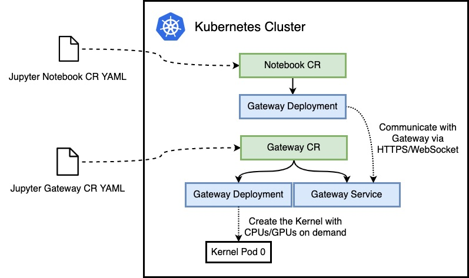

There are 5 CRDs defined in elastic-jupyter-operator:

- jupytergateways.kubeflow.tkestack.io
- jupyterkernels.kubeflow.tkestack.io
- jupyterkernelspecs.kubeflow.tkestack.io
- jupyterkerneltemplates.kubeflow.tkestack.io
- jupyternotebooks.kubeflow.tkestack.io

elastic-jupyter-operator 的架构如图所示，`JupyterGateway` 和 `JupyterNotebook` 是两个 CRD。其中 Notebook 是 Jupyter Notebook 的前端服务，负责面向用户提供用户界面，并且与后端服务通过 HTTPS 和 Websocket 进行通信，处理用户的计算请求。

Gateway 是对应的后端服务。它负责处理来自 Notebook CR 的请求，通过调用 Kubernetes 的 API 按需创建出真正负责处理用户计算任务的 Kernel。

